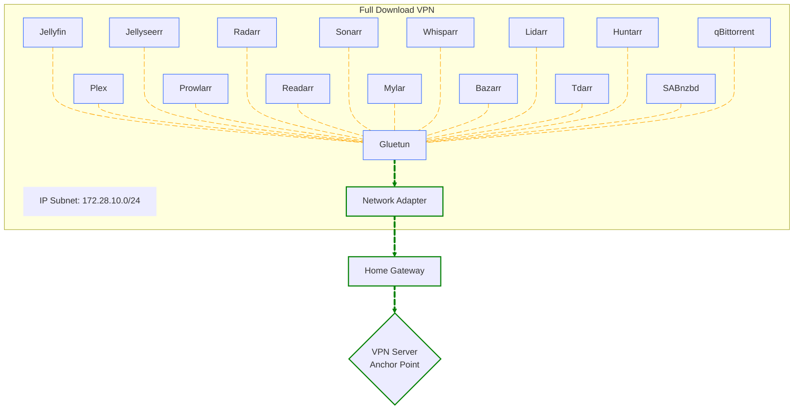
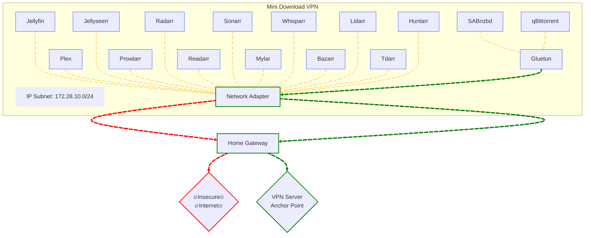
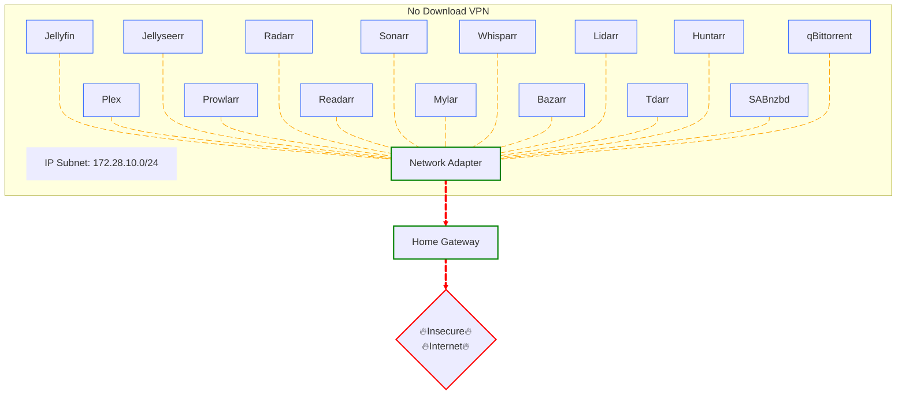
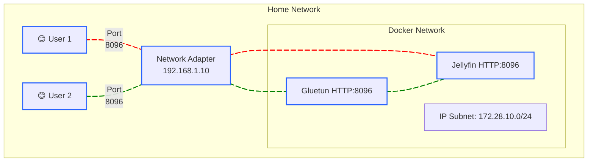

# MediaStack Project (Docker)  

See you on [Reddit for MediaStack](https://www.reddit.com/r/MediaStack/)  

## What Applications Are Provided In MediaStack  

Welcome to the MediaStack project! MediaStack is your ultimate solution for managing and streaming media collections with applications like Jellyfin and Plex. Using Docker, MediaStack containerises these media servers alongside *ARR applications (Radarr, Sonarr, Lidarr, etc.) for seamless media automation and management.  

List of Docker applications configured in the MediaStack `docker-compose.yaml` file:  

</br>

<center>

| <center> Docker Application </center> | <center> Application Role </center> |  
|--------------------|------------------|  
| [Authentik](https://docs.goauthentik.io/docs/install-config/install/docker-compose) | Authentik is an open-source identity provider for SSO, MFA, and access control |  
| [Bazarr](https://docs.linuxserver.io/images/docker-bazarr) | Bazarr automates the downloading of subtitles for Movies and TV Shows |  
| [Chromium](https://docs.linuxserver.io/images/docker-chromium/) | Chromium is an an open-source web browser, allowing secure remote Internet browsing through your MediaStack |  
| [CrowdSec](https://docs.crowdsec.net/u/getting_started/installation/docker/) | CrowdSec is an open-source, collaborative intrusion prevention system that detects and blocks malicious IPs |  
| [DDNS-Updater](https://hub.docker.com/r/qmcgaw/ddns-updater) | DDNS-Updater automatically updates dynamic DNS records when your home Internet changes IP address |  
| [Filebot](https://www.filebot.net/) | FileBot is a tool for renaming and organising media files using online metadata sources |  
| [Flaresolverr](https://github.com/FlareSolverr/FlareSolverr) | Flaresolverr bypasses Cloudflare protection, allowing automated access to websites for scripts and bots |  
| [Gluetun](https://github.com/qdm12/gluetun-wiki) | Gluetun routes network traffic through a VPN, ensuring privacy and security for Docker containers |  
| [Grafana](http://docs.grafana.org/installation/docker/) | Grafana is an open-source analytics platform for visualising metrics, logs, and time-series data |  
| [Guacamole](https://hub.docker.com/r/guacamole/guacamole) | Guacamole is a clientless remote desktop gateway supporting RDP, VNC, and SSH through a web browser |  
| [Headplane](https://github.com/tale/headplane) | Headplane is a web-based user interface for managing Headscale, the self-hosted alternative to Tailscale |  
| [Headscale](https://headscale.net/stable/) | Headscale is an open-source, self-hosted alternative to Tailscale's control server for managing WireGuard-based VPNs |  
| [Heimdall](https://docs.linuxserver.io/images/docker-heimdall) | Heimdall provides a dashboard to easily access and organise web applications and services |  
| [Homarr](https://homarr.dev/docs/getting-started/after-the-installation) | Homarr is a self-hosted, customisable dashboard for managing and monitoring your server applications |  
| [Homepage](https://gethomepage.dev/latest/configs/) | Homepage is an alternate to Heimdall, providing a similar dashboard to easily access and organise web applications and services |  
| [Huntarr](https://github.com/plexguide/Huntarr.io) | Huntarr is an open-source tool that automates finding missing and upgrading media in *ARR libraries |  
| [Jellyfin](https://jellyfin.org/docs/general/administration/installing#docker) | Jellyfin is a media server that organises, streams, and manages multimedia content for users |  
| [Jellyseerr](https://hub.docker.com/r/fallenbagel/jellyseerr) | Jellyseerr is a request management tool for Jellyfin, enabling users to request and manage media content |  
| [Lidarr](https://docs.linuxserver.io/images/docker-lidarr) | Lidarr is a Library Manager, automating the management and meta data for your music media files |  
| [Mylar](https://github.com/mylar3/mylar3/wiki) | Mylar3 is a Library Manager, automating the management and meta data for your comic media files |  
| [Plex](https://hub.docker.com/r/linuxserver/plex) | Plex is a media server that organises, streams, and manages multimedia content across devices |  
| [Portainer](https://docs.portainer.io/start/install/server/docker) | Portainer provides a graphical interface for managing Docker environments, simplifying container deployment and monitoring |  
| [Postgresql](https://hub.docker.com/_/postgres) | PostgreSQL is a powerful, open-source relational database system known for reliability and advanced features |  
| [Prometheus](https://prometheus.io/docs/introduction/overview/) | Prometheus is an open-source monitoring system that collects and queries metrics using a time-series database |  
| [Prowlarr](https://docs.linuxserver.io/images/docker-prowlarr) | Prowlarr manages and integrates indexers for various media download applications, automating search and download processes |  
| [qBittorrent](https://docs.linuxserver.io/images/docker-qbittorrent) | qBittorrent is a peer-to-peer file sharing application that facilitates downloading and uploading torrents |  
| [Radarr](https://docs.linuxserver.io/images/docker-radarr) | Radarr is a Library Manager, automating the management and meta data for your Movie media files |  
| [Readarr](https://docs.linuxserver.io/images/docker-readarr) | is a Library Manager, automating the management and meta data for your eBooks and Comic media files |  
| [SABnzbd](https://docs.linuxserver.io/images/docker-sabnzbd) | SABnzbd is a Usenet newsreader that automates the downloading of binary files from Usenet |  
| [Sonarr](https://docs.linuxserver.io/images/docker-sonarr) | Sonarr is a Library Manager, automating the management and meta data for your TV Shows (series) media files |  
| [Tailscale](https://tailscale.com/) | Tailscale is a secure, peer-to-peer VPN that simplifies network access using WireGuard technology |  
| [Tdarr](https://docs.tdarr.io/docs/installation/docker/run-compose/) | Tdarr automates the transcoding and management of media files to optimise storage and playback compatibility |  
| [Traefik](https://doc.traefik.io/traefik/) | Traefik is a modern reverse proxy and load balancer for microservices and containerised applications with full TLS v1.2 & v1.3 support |  
| [Traefik-Certs-Dumper](https://hub.docker.com/r/ldez/traefik-certs-dumper) | Traefik Certs Dumper extracts TLS certificates and private keys from Traefik and converts for use by other services |  
| [Unpackerr](https://github.com/davidnewhall/unpackerr) | Unpackerr extracts and moves downloaded media files to their appropriate directories for organisation and access |  
| [Valkey](https://hub.docker.com/r/valkey/valkey) | Valkey is an open-source, high-performance, in-memory key-value datastore, serving as a drop-in replacement for Redis |  
| [Whisparr](https://wiki.servarr.com/whisparr) | Whisparr is a Library Manager, automating the management and meta data for your Adult media files |  

</br></br>

| <center>Ubuntu Linux Install - Docker Compose Build</center> | <center>Windows 11 Install - Docker with WSL and Ubuntu</center> |  
|----------------------------------------|----------------------------------------|  
| [](https://youtu.be/zz2XjrurgXI "MediaStack - A Detailed Installation Walkthru (Ubuntu Linux)") | [](https://youtu.be/N--e1O5SqPw "MediaStack - Ultimate Guide on Windows 11 Docker with WSL and Ubuntu") |  

</br>

</center>

</br></br>

MediaStack is your ultimate solution for managing and streaming media collections with applications like Jellyfin and Plex. Using Docker, MediaStack containerises these media servers alongside *ARR applications (Radarr, Sonarr, Lidarr, etc.) for seamless media automation and management.  

You will also be able to connect to your MediaStack instance security from the Internet using the following two methods:  

- **Secure Reverse Proxy:** Traefik, Authentik, and CrowdSec provides a full reverse proxy solution with free Let's Encrypt digital certificates, including SSO / OAuth2 / OpenID / SAML / Radius / LDAP identity providers and MFA. Traefik Certs Dumper extracts the Let's Encrypt cetificates so you can install them on other systems.  

- **Secure Tailscale VPN:** Headscale is an open source Tailscale Coordination Server, allowing remote Tailscale clients to connect to the Headscale and Tailscale applications, and accessing all of the containers over the VPN connection. Include Headplane to provide a WebUI portal to manage Headscale settings.  

> **NOTE:** The Traefik reverse proxy configuration for incoming connections, has been configured with the strongest of the modern cipher suites, using only TLSv1.2 and TSLv1.3 as minimum protocols, and enforces strong security headers to provide your MediaStack with the strongest security / privacy when you connect from the Internet.  

</br>

## Internal Container Access (From Home)

Edit the "**Import Bookmarks - MediaStackGuide Applications (Internal URLs).html**" file, and find / replace all of the **`localhost`** entries with the IP address running Docker in your home network.  

Then import the Bookmarks into your web browser.  

## External Container Access (From Internet)

Edit the "**Import Bookmarks - MediaStackGuide Applications (External URLs).html**" file, and find / replace all of the **`YOUR_DOMAIN_NAME`** entries with your Internet domain name.  

All of the Docker images / containers in the Docker Compose file, have already been labelled for Traefik, and they will be automatically detected and assigned the correct routing based on the incoming Internet URL, using your domain name.  

Port forward your incoming connections on your home Internet gateway / router, to the IP Address of your computer running Docker, using Ports 80 and 443 - If these are taken, you can use alternate ports using the **REVERSE_PROXY_PORT_HTTP(S)** settings in the **.ENV** variable file.  

## How Do I Use The MediaStack Repo  

- **base-working-files:** Download all of these files into a single directory located on your Docker computer. Then download the `docker-compose.yaml` file located in one of the following configurations, into the same directory.  

- **docker-compose.yaml:** Download one of the `docker-compose.yaml` configuration files:  

  - **full-download-vpn:** The `docker-compose.yaml` file located in this directory is configured so all outgoing network connections / media downloads are protected with the Gluetun VPN Tunnel, to provide maximum privacy on your Internet connection. **This is the recommended configuration for new users**.  

  - **mini-download-vpn:** The `docker-compose.yaml` file located in this directory is configured so only the SABnzbd (Usenet) and qBittorrent (Torrents) are protected with the Gluetun VPN Tunnel, to provide a moderate level of privacy just on your download activities.  

  - **no-download-vpn:** The `docker-compose.yaml` file located in this directory does not have Gluetun, or any other form of VPN for outgoing Internet traffic; you will have limited no privacy on downloads.  

You can now configure the `docker-compose.yaml`, `.env`, and other files downloaded from the **base-working-files** configuration directory.  

</br>

## What is: "Full Download VPN"

This configuration set builds a fully encrypted VPN network architecture, and routes all network traffic from the Docker containers through the Gluetun container, where it is encrypted into a VPN, before it passes securely across the internet. This setup ensures that all data packets are encrypted, providing robust privacy and security. The primary benefit of this approach is the comprehensive protection of data, safeguarding against eavesdropping, and maintaining user privacy.  

However, this heightened security method comes with trade-offs. Encrypting and decrypting all traffic can lead to increased latency and reduced network speeds. This can particularly impact applications requiring high bandwidth or low latency, such as media streaming or real-time communication tools. Nonetheless, for users prioritising privacy and security over speed, this setup is ideal.  

</br>
<center>


``` mermaid
flowchart TD
  subgraph DockerNet["Full Download VPN"]
    Gluetun
    Jellyfin
    Plex
    Jellyseerr
    Prowlarr
    Radarr
    Readarr
    Sonarr
    Mylar
    Whisparr
    Bazarr
    Lidarr
    Tdarr
    Huntarr
    SABnzbd
    qBittorrent
    Label@{ label: "<div style=\"color:\"><span style=\"color:\">IP Subnet: 172.28.10.0/24</span></div>" }
    NIC["Network Adapter"]
  end

  Jellyfin     Jellyfin_Gluetun@    ---- Gluetun
  Plex         Plex_Gluetun@        ---  Gluetun
  Jellyseerr   Jellyseerr_Gluetun@  ---- Gluetun
  Prowlarr     Prowlarr_Gluetun@    ---  Gluetun
  Radarr       Radarr_Gluetun@      ---- Gluetun
  Readarr      Readarr_Gluetun@     ---  Gluetun
  Sonarr       Sonarr_Gluetun@      ---- Gluetun
  Mylar        Mylar_Gluetun@       ---  Gluetun
  Whisparr     Whisparr_Gluetun@    ---- Gluetun
  Bazarr       Bazarr_Gluetun@      ---  Gluetun
  Lidarr       Lidarr_Gluetun@      ---- Gluetun
  Tdarr        Tdarr_Gluetun@       ---  Gluetun
  Huntarr      Huntarr_Gluetun@     ---- Gluetun
  SABnzbd      SABnzbd_Gluetun@     ---  Gluetun
  qBittorrent  qBittorrent_Gluetun@ ---- Gluetun
  Gluetun      Gluetun_NIC@         ==> NIC
  NIC          NIC_Gateway@         ==> Gateway
  Gateway      Gateway_VPN@         ==> VPN
  Gateway["Home Gateway"]
  VPN{"VPN Server<br>Anchor Point"}

  style Gluetun      stroke:#2962FF
  style Jellyfin     stroke:#2962FF
  style Plex         stroke:#2962FF
  style Jellyseerr   stroke:#2962FF
  style Prowlarr     stroke:#2962FF
  style Radarr       stroke:#2962FF
  style Readarr      stroke:#2962FF
  style Sonarr       stroke:#2962FF
  style Mylar        stroke:#2962FF
  style Whisparr     stroke:#2962FF
  style Bazarr       stroke:#2962FF
  style Lidarr       stroke:#2962FF
  style Tdarr        stroke:#2962FF
  style Huntarr      stroke:#2962FF
  style SABnzbd      stroke:#2962FF
  style qBittorrent  stroke:#2962FF
  style Label        stroke:none
  style NIC          stroke:green,    stroke-width:2px
  style Gateway      stroke:green,    stroke-width:2px
  style VPN          stroke:green,    stroke-width:2px

  linkStyle 0        stroke:orange
  linkStyle 1        stroke:orange
  linkStyle 2        stroke:orange
  linkStyle 3        stroke:orange
  linkStyle 4        stroke:orange
  linkStyle 5        stroke:orange
  linkStyle 6        stroke:orange
  linkStyle 7        stroke:orange
  linkStyle 8        stroke:orange
  linkStyle 9        stroke:orange
  linkStyle 10       stroke:orange
  linkStyle 11       stroke:orange
  linkStyle 12       stroke:orange
  linkStyle 13       stroke:orange
  linkStyle 14       stroke:orange
  linkStyle 15       stroke:green
  linkStyle 16       stroke:green
  linkStyle 17       stroke:green

  Jellyfin_Gluetun@{     animation: fast }
  Plex_Gluetun@{         animation: fast }
  Jellyseerr_Gluetun@{   animation: fast }
  Prowlarr_Gluetun@{     animation: fast }
  Radarr_Gluetun@{       animation: fast }
  Readarr_Gluetun@{      animation: fast }
  Sonarr_Gluetun@{       animation: fast }
  Mylar_Gluetun@{        animation: fast }
  Whisparr_Gluetun@{     animation: fast }
  Bazarr_Gluetun@{       animation: fast }
  Lidarr_Gluetun@{       animation: fast }
  Tdarr_Gluetun@{        animation: fast }
  Huntarr_Gluetun@{      animation: fast }
  SABnzbd_Gluetun@{      animation: fast }
  qBittorrent_Gluetun@{  animation: fast }
  Gluetun_NIC@{          animation: slow }
  NIC_Gateway@{          animation: slow }
  Gateway_VPN@{          animation: slow }
```

</center>
</br></br>

> NOTE: Many of the Docker applications are passing traffic through the Gluetun VPN container. When the Gluetun container stops, or if the VPN network connection is interrupted, then all network traffic for the other Docker applications, will also stop until Gluetun re-establishes the secure VPN connection.

</br>

## What is: "Mini Download VPN"

This configuration set builds a minimal encrypted VPN network, soley for the Torrent and Usenet downloads for the qBittorrent and SABnzbd Docker containers, which route all network traffic through the Gluetun Docker container, where it is encrypted into a VPN before routing out to the Internet. All other Docker containers connect to the Docker bridge network (not Gluetun), and pass their network traffic directly out to the Internet though your Internet Service Provider. This approach ensures that only the Torrent and Usenet downloaded data is encrypted, while other containers operate with unencrypted traffic flows. The advantage here is that it maintains higher network performance for most applications, avoiding potential latency and bandwidth reductions associated with full encryption.  

However, this comes at the cost of leaving some network traffic potentially exposed to interception or monitoring. This setup is suitable for users who require high performance for certain applications but still want to protect specific, sensitive download activities.  

</br>
<center>


``` mermaid
flowchart TD
  subgraph DockerNet["Mini Download VPN"]
    Gluetun
    Jellyfin
    Plex
    Jellyseerr
    Prowlarr
    Radarr
    Readarr
    Sonarr
    Mylar
    Whisparr
    Bazarr
    Lidarr
    Tdarr
    Huntarr
    SABnzbd
    qBittorrent
    Label@{ label: "<div style=\"color:\"><span style=\"color:\">IP Subnet: 172.28.10.0/24</span></div>" }
    NIC["Network Adapter"]
  end

  Jellyfin     Jellyfin_NIC@        ---- NIC
  Plex         Plex_NIC@            ---  NIC
  Jellyseerr   Jellyseerr_NIC@      ---- NIC
  Prowlarr     Prowlarr_NIC@        ---  NIC
  Radarr       Radarr_NIC@          ---- NIC
  Readarr      Readarr_NIC@         ---  NIC
  Sonarr       Sonarr_NIC@          ---- NIC
  Mylar        Mylar_NIC@           ---  NIC
  Whisparr     Whisparr_NIC@        ---- NIC
  Bazarr       Bazarr_NIC@          ---  NIC
  Lidarr       Lidarr_NIC@          ---- NIC
  Tdarr        Tdarr_NIC@           ---  NIC
  Huntarr      Huntarr_NIC@         ---- NIC
  SABnzbd      SABnzbd_Gluetun@     ---  Gluetun
  qBittorrent  qBittorrent_Gluetun@ ---  Gluetun
  Gluetun      Gluetun_NIC@         ==>  NIC
  NIC          NIC_Gateway_0@       ==>  Gateway
  NIC          NIC_Gateway_1@       ==>  Gateway
  Gateway      Gateway_VPN_1@       ==>  Internet
  Gateway      Gateway_VPN_0@       ==>  VPN
  Gateway["Home Gateway"]
  Internet{"🔥Insecure🔥<br>🔥Internet🔥"}
  VPN{"VPN Server<br>Anchor Point"}

  style Gluetun      stroke:#2962FF
  style Jellyfin     stroke:#2962FF
  style Plex         stroke:#2962FF
  style Jellyseerr   stroke:#2962FF
  style Prowlarr     stroke:#2962FF
  style Radarr       stroke:#2962FF
  style Readarr      stroke:#2962FF
  style Sonarr       stroke:#2962FF
  style Mylar        stroke:#2962FF
  style Whisparr     stroke:#2962FF
  style Bazarr       stroke:#2962FF
  style Lidarr       stroke:#2962FF
  style Tdarr        stroke:#2962FF
  style Huntarr      stroke:#2962FF
  style SABnzbd      stroke:#2962FF
  style qBittorrent  stroke:#2962FF
  style Label        stroke:none
  style NIC          stroke:green,    stroke-width:2px
  style Gateway      stroke:green,    stroke-width:2px
  style Internet     stroke:red,      stroke-width:2px
  style VPN          stroke:green,    stroke-width:2px

  linkStyle 0        stroke:orange
  linkStyle 1        stroke:orange
  linkStyle 2        stroke:orange
  linkStyle 3        stroke:orange
  linkStyle 4        stroke:orange
  linkStyle 5        stroke:orange
  linkStyle 6        stroke:orange
  linkStyle 7        stroke:orange
  linkStyle 8        stroke:orange
  linkStyle 9        stroke:orange
  linkStyle 10       stroke:orange
  linkStyle 11       stroke:orange
  linkStyle 12       stroke:orange
  linkStyle 13       stroke:orange
  linkStyle 14       stroke:orange
  linkStyle 15       stroke:green
  linkStyle 16       stroke:red
  linkStyle 17       stroke:green
  linkStyle 18       stroke:red
  linkStyle 19       stroke:green

  Jellyfin_NIC@{         animation: fast }
  Plex_NIC@{             animation: fast }
  Jellyseerr_NIC@{       animation: fast }
  Prowlarr_NIC@{         animation: fast }
  Radarr_NIC@{           animation: fast }
  Readarr_NIC@{          animation: fast }
  Sonarr_NIC@{           animation: fast }
  Mylar_NIC@{            animation: fast }
  Whisparr_NIC@{         animation: fast }
  Bazarr_NIC@{           animation: fast }
  Lidarr_NIC@{           animation: fast }
  Tdarr_NIC@{            animation: fast }
  Huntarr_NIC@{          animation: fast }
  SABnzbd_Gluetun@{      animation: fast }
  qBittorrent_Gluetun@{  animation: fast }
  Gluetun_NIC@{          animation: slow }
  NIC_Gateway_0@{        animation: slow }
  NIC_Gateway_1@{        animation: slow }
  Gateway_VPN_0@{        animation: slow }
  Gateway_VPN_1@{        animation: slow }
```

</center>
</br>

## What is: "No Download VPN"

The Gluetun VPN container has been removed from this network architecture / design, and the containers are all communicating directly to the Internet without any VPN for privacy.

</br>
<center>


``` mermaid
flowchart TD
  subgraph DockerNet["No Download VPN"]
    Jellyfin
    Plex
    Jellyseerr
    Prowlarr
    Radarr
    Readarr
    Sonarr
    Mylar
    Whisparr
    Bazarr
    Lidarr
    Tdarr
    Huntarr
    SABnzbd
    qBittorrent
    Label@{ label: "<div style=\"color:\"><span style=\"color:\">IP Subnet: 172.28.10.0/24</span></div>" }
    NIC["Network Adapter"]
  end

  Jellyfin     Jellyfin_NIC@     ---- NIC
  Plex         Plex_NIC@         ---  NIC
  Jellyseerr   Jellyseerr_NIC@   ---- NIC
  Prowlarr     Prowlarr_NIC@     ---  NIC
  Radarr       Radarr_NIC@       ---- NIC
  Readarr      Readarr_NIC@      ---  NIC
  Sonarr       Sonarr_NIC@       ---- NIC
  Mylar        Mylar_NIC@        ---  NIC
  Whisparr     Whisparr_NIC@     ---- NIC
  Bazarr       Bazarr_NIC@       ---  NIC
  Lidarr       Lidarr_NIC@       ---- NIC
  Tdarr        Tdarr_NIC@        ---  NIC
  Huntarr      Huntarr_NIC@      ---- NIC
  SABnzbd      SABnzbd_NIC@      ---  NIC
  qBittorrent  qBittorrent_NIC@  ---- NIC
  NIC          NIC_Gateway@      ==>  Gateway
  Gateway      Gateway_VPN@      ==>  Internet
  Gateway["Home Gateway"]
  Internet{"🔥Insecure🔥<br>🔥Internet🔥"}
  
  style Jellyfin     stroke:#2962FF
  style Plex         stroke:#2962FF
  style Jellyseerr   stroke:#2962FF
  style Prowlarr     stroke:#2962FF
  style Radarr       stroke:#2962FF
  style Readarr      stroke:#2962FF
  style Sonarr       stroke:#2962FF
  style Mylar        stroke:#2962FF
  style Whisparr     stroke:#2962FF
  style Bazarr       stroke:#2962FF
  style Lidarr       stroke:#2962FF
  style Tdarr        stroke:#2962FF
  style Huntarr      stroke:#2962FF
  style SABnzbd      stroke:#2962FF
  style qBittorrent  stroke:#2962FF
  style Label        stroke:none
  style NIC          stroke:green,    stroke-width:2px
  style Gateway      stroke:green,    stroke-width:2px
  style Internet     stroke:red,      stroke-width:2px
  
  linkStyle 0       stroke:orange
  linkStyle 1       stroke:orange
  linkStyle 2       stroke:orange
  linkStyle 3       stroke:orange
  linkStyle 4       stroke:orange
  linkStyle 5       stroke:orange
  linkStyle 6       stroke:orange
  linkStyle 7       stroke:orange
  linkStyle 8       stroke:orange
  linkStyle 9       stroke:orange
  linkStyle 10      stroke:orange
  linkStyle 11      stroke:orange
  linkStyle 12      stroke:orange
  linkStyle 13      stroke:orange
  linkStyle 14      stroke:orange
  linkStyle 15      stroke:red
  linkStyle 16      stroke:red

  Jellyfin_NIC@{         animation: fast }
  Plex_NIC@{             animation: fast }
  Jellyseerr_NIC@{       animation: fast }
  Prowlarr_NIC@{         animation: fast }
  Radarr_NIC@{           animation: fast }
  Readarr_NIC@{          animation: fast }
  Sonarr_NIC@{           animation: fast }
  Mylar_NIC@{            animation: fast }
  Whisparr_NIC@{         animation: fast }
  Bazarr_NIC@{           animation: fast }
  Lidarr_NIC@{           animation: fast }
  Tdarr_NIC@{            animation: fast }
  Huntarr_NIC@{          animation: fast }
  SABnzbd_NIC@{          animation: fast }
  qBittorrent_NIC@{      animation: fast }
  NIC_Gateway@{          animation: slow }
  Gateway_VPN@{          animation: slow }
```

</center>
</br>

## What Do I Need To Configure

Follow the steps below to deploy your MediaStack quickly:  

- Download all of the files in the `base-working-file` GitHub folder, and **one** of the pre-configured `docker-compose.yaml` files into the same directory  
- Update the `.env` file with all the configuration settings / values for your system needs  
- Replace `vflorio.com` with your Internet domain in the following files:  
  - `headscale-config.yaml`  
  - `headplane-config.yaml`  
  - `traefik-dynamic.yaml`  
  - `traefik-internal.yaml`  
  - `traefik-static.yaml`  
- Update `cookie_secret` variable in `headplane-config.yaml` using 32 random characters  
- Update `restart.sh` script with your values for:  
  - **`FOLDER_FOR_YAMLS`**=/docker &nbsp;  &nbsp;  &nbsp;  &nbsp;  &nbsp;  &nbsp;  &nbsp;  &nbsp; # <-- Folder where the yaml and .env files are located  
- Enable execution of shell scripts with `sudo chmod 775 *sh`  

Start your MediaStack with `./restart.sh`  

> NOTE: The `restart.sh` script reads the variables in the `.env` environment file, then does most of the configuration / management for you - it will tell you if you have issues.  

The Postgresql server still needs some minor configuration to complete the MediaStack deployment:  

- Set access permissions on Authentik Postgresql database with `./secure_authentik_database.sh` script  
- Set up Guacamole Postgresql database and access permissions with `./create_guacamole_database.sh` script  

Restart MediaStack again after changes with `./restart.sh`  

</br>

## Starting / Maintaining MediaStack

To start MediaStack, you first need to configure all of the files for your system... i.e. variables for storage locations and docker user id. Then you can start your stack with the following commands:

``` bash
sudo chmod 775 *sh
./restart.sh
```

The `restart.sh` script will:

- **Reads** the variables and values saved in the `.env` environment file to manage the MediaStack using your configuration.  

- **Creates** folder structure for all of the persistant storage data, and for your download / media files.  

- **Permissions** are set on all files and directories for the persistant data and download / media files.

- **Validates** configuration of the `docker-compose.yaml` and `.env` files for errors to ensure MediaStack will start before shutting down the running containers.  

- **Download** all of the Docker images needed to run MediaStack, if there are newer Docker images on the internet (than on your Docker host), then it will download the `latest` images from the Internet.  

- **Shutdown** all running Docker applications and forcably purge all **non-persistent** Docker containers, volumes, and networks (MediaStack stores all persistent data in the storage locations from the configuration files to survive reboots / system failure).  

- **Moves** all of the configuration files you downloaded / edited, into the correct working locations within the persistent data storage directories.  

- **Restart** all Docker containers. If newer images were downloaded during the restart, then they will be used and the application will use the same persistent data volumes.  

- **Purge** all Docker images that are not presently being used after the restart. This will delete the older / unused images after newer images have been downloaded.  

> NOTE: The **`restart.sh`** script was written to be the most effective / effecient way to easily deploy and update the MediaStack with new releases, and is recommended for new users.  

``` bash
./secure_authentik_database.sh
```

The `secure_authentik_database.sh` script will secure the active Authentik database in Postgresql with a database username and password.

``` bash
./create_guacamole_database.sh
```

The `create_guacamole_database.sh` script will create the new database and schema in Postgresql for Guacamole and secure the database with a username and password.

> NOTE: The **`secure_authentik_database.sh`** and **`create_guacamole_database.sh`** scripts are mainly used during initial setup of MediaStack, and are only considered one-purpose use.

</br>

## Check Status of VPN Connection

The MediaStack project focuses on **Security** and **Privacy** as some of the basic networking concepts, and uses the Gluetun Docker application to encrypt your network traffic as it passes across the Internet.

If you are having network connectivity issues, or would like to check the network status of your Docker applications, there are several commands / checks that you can perform to check on connection status.

- Check running Docker processes:

``` bash
sudo docker ps
```

- Check IP Addresses of containers in the "mediastack" network:

``` bash
sudo docker network inspect mediastack | grep -E '("Name"|IPv4)'
```

- Connect to Gluetun Docker container and check the IP Address:

``` bash
sudo docker exec gluetun /bin/sh -c "wget -qO- ifconfig.io"
```

- Use the following command to connect to the Docker application and start a shell CLI:

``` bash
sudo docker exec -it gluetun /bin/sh
```

- Use the following web links to check your own IP Address, and the location of the VPN IP Address:

  - [https://ifconfig.io](https://ifconfig.io)  
  - [https://iplocation.net](https://iplocation.net)  

</br>  

> **REMEMBER:**   If the Gluetun container is not running, or the VPN connection is down, then all Docker containers behind the Gluetun VPN container will stop passing network traffic.  

</br>

## How To Access The Applications In Home Network

Understanding how to access the Docker applications within your own home network can be a confusing concept for those new to Docker, more so when some of the Docker applications are hidden behind other Docker applications, such as Gluetun.  

Imagine the following deployment scenario:  

- **User 1** has deployed their Docker applications using the "**Mini Download VPN**" YAML files, so only the qBittorrent container is using the Gluetun VPN to encrypt network traffic to the Internet. Therefore, **User 1** accesses the **Jellyfin** application directly, with the URL of: **<http://jellyfin:8096>**.  

- **User 2** has deployed their Docker applications using the "**Full Download VPN**" YAML files, which has all of the "Media Player" and "Downloading" Docker containers connecting to the Internet through the Gluetun VPN, encrypting all network traffic. Therefore, **User 2**  accesses the **Jellyfin** application by using the Gluetun container, which then uses port-redirection to forward the network traffic into Jellyfin. This URL will be: **<http://gluetun:8096>**.  

The YAML configuration files are already set up to do all the network firewalling, port forwarding, and VPN connections as standard, all that most people will need to do, it just update the **`docker-compose.env`** file and update all the IP Addresses for VPN login details for your own environment.  

</br>
<center>


``` mermaid
flowchart TB
  subgraph HomeNet["Home Network"]
    user1
    user2
    NIC
    subgraph DockerNet["Docker Network"]
      Gluetun
      Jellyfin
      Label@{ label: "<div style=\"color:\"><span style=\"color:\">IP Subnet: 172.28.10.0/24</span></div>" }
    end
  Gluetun
  end

  user1     user1_NIC@         -- Port</br>8096 --- NIC
  user2     user2_NIC@         -- Port</br>8096 --- NIC
  NIC       NIC_Jellyfin@      --- Jellyfin
  NIC       NIC_Gluetun@       --- Gluetun
  Gluetun   Gluetun_Jellyfin@  --- Jellyfin

  user1["😊 User 1"]
  user2["😊 User 2"]
  NIC["Network Adapter<p>192.168.1.10"]
  Gluetun["Gluetun HTTP:8096"]
  Jellyfin["Jellyfin HTTP:8096"]
  
  style user1     stroke:#2962FF,   stroke-width:2px
  style user2     stroke:#2962FF,   stroke-width:2px
  style NIC       stroke:#2962FF,   stroke-width:2px
  style Gluetun   stroke:#2962FF,   stroke-width:2px
  style Jellyfin  stroke:#2962FF,   stroke-width:2px

  linkStyle 0     stroke:red,       stroke-width:2px,  stroke-dasharray:5
  linkStyle 1     stroke:green,     stroke-width:2px,  stroke-dasharray:5
  linkStyle 2     stroke:red,       stroke-width:2px,  stroke-dasharray:5
  linkStyle 3     stroke:green,     stroke-width:2px,  stroke-dasharray:5
  linkStyle 4     stroke:green,     stroke-width:2px,  stroke-dasharray:5

  user1_NIC@{        animation: slow }
  user2_NIC@{        animation: fast }
  NIC_Jellyfin@{     animation: slow }
  NIC_Gluetun@{      animation: fast }
  Gluetun_Jellyfin@{ animation: fast }
```

</center>
</br></br>

The network settings for your home network, and the Docker network, can be adjusted in the **`.env`** file. Likewise, if the Gluetun container is routing outbound VPN traffic for any of the Docker applications, it can also accept inbound network traffic and re-route the traffic to any of the Docker containers connected to the Gluetun VPN, based on the port redirect rules in the Gluetun YAML file.

The different network VPN security, and inbound redirection to the Gluetun attached Docker applications have already been configured in the YAML files, most users should just need to adjust the **`.env`** file to suit your network IP addressing, then deploy the applications using the **`./restart.sh`** script.

</br>

## How Are The Filesystems Mapped Between The Docker Application And The Host Computer ?

All of the filesystems are automatically mapped between your host computers hard drives, and the virtual drives within the Docker containers. The filesystem mapping is configured in all of the YAML configuration files, so the Docker applications use the same folder structure.

You will need to set up the following variables in the **`.env`** environment configuration file, so the Docker applications can connect to the media / data storage on the local computer.

``` bash
FOLDER_FOR_MEDIA=/your-media-folder       # Change to where you want your media to be stored
FOLDER_FOR_DATA=/your-app-configs         # Change to where you want your container configurations to be stored
```

The **`FOLDER_FOR_MEDIA`** variable can be either Linux, Windows, MacOS, Synology, or NFS filesystems, and is the location for all of the **media storage, and transient download files** being used by the Bittorrent and Usenet applications. The filesystem mapping and directory structure between the Docker host computer, and the Docker applications, is shown in the folder structure below.  

The **`FOLDER_FOR_DATA`** variable can also be either Linux, Windows, MacOS, Synology, or NFS filesystems, and is the **configuration storage** for all of the Docker applications. Docker will store the running configuration of each of the Docker applications, into their own directory, inside the **`FOLDER_FOR_DATA`** directory.  

The **`restart.sh`** script will automatically create the directory structure below, based on the values you add in the **`.env`** file.  

``` { .text .no-copy }
    $ tree $FOLDER_FOR_MEDIA

    ⠀⠀⠀⠀⠀Docker Host Computer:⠀⠀⠀⠀⠀⠀⠀⠀⠀Inside Docker Containers:
    ├── /FOLDER_FOR_MEDIA   ⠀       ├── /data
    ⠀⠀⠀⠀⠀├── media                  ⠀⠀⠀⠀├── media        <-- Media is stored / managed under this folder
    ⠀⠀⠀⠀⠀│⠀⠀⠀⠀├── anime                 │⠀⠀⠀⠀├── anime       <-- Sonarr Media Library Manager
    ⠀⠀⠀⠀⠀│⠀⠀⠀⠀├── audio                 │⠀⠀⠀⠀├── audio       <-- Lidarr Media Library Manager
    ⠀⠀⠀⠀⠀│⠀⠀⠀⠀├── books                 │⠀⠀⠀⠀├── books       <-- Readarr Media Library Manager
    ⠀⠀⠀⠀⠀│⠀⠀⠀⠀├── comics                │⠀⠀⠀⠀├── comics      <-- Mylar Media Library Manager
    ⠀⠀⠀⠀⠀│⠀⠀⠀⠀├── movies                │⠀⠀⠀⠀├── movies      <-- Radarr Media Library Manager
    ⠀⠀⠀⠀⠀│⠀⠀⠀⠀├── music                 │⠀⠀⠀⠀├── music       <-- Lidarr Media Library Manager
    ⠀⠀⠀⠀⠀│⠀⠀⠀⠀├── photos                │⠀⠀⠀⠀├── photos      <-- N/A - Add Personal Photos
    ⠀⠀⠀⠀⠀│⠀⠀⠀⠀├── tv                    │⠀⠀⠀⠀├── tv          <-- Sonarr Media Library Manager
    ⠀⠀⠀⠀⠀│⠀⠀⠀⠀└── xxx                   │⠀⠀⠀⠀└── xxx         <-- Whisparr Media Library Manager
    ⠀⠀⠀⠀⠀├── torrents               ⠀⠀⠀⠀├── torrents     <-- Folder for Torrent Downloads Data
    ⠀⠀⠀⠀⠀│⠀⠀⠀⠀├── anime                 │⠀⠀⠀⠀├── anime       <-- Anime Category (Sonarr)
    ⠀⠀⠀⠀⠀│⠀⠀⠀⠀├── audio                 │⠀⠀⠀⠀├── audio       <-- Audio Category (Lidarr)
    ⠀⠀⠀⠀⠀│⠀⠀⠀⠀├── books                 │⠀⠀⠀⠀├── books       <-- Book Category (Readarr)
    ⠀⠀⠀⠀⠀│⠀⠀⠀⠀├── comics                │⠀⠀⠀⠀├── comics      <-- Comic Category (Mylar)
    ⠀⠀⠀⠀⠀│⠀⠀⠀⠀├── complete              │⠀⠀⠀⠀├── complete    <-- Completed / General Downloads
    ⠀⠀⠀⠀⠀│⠀⠀⠀⠀├── console               │⠀⠀⠀⠀├── console     <-- Comic Category (Manual DL)
    ⠀⠀⠀⠀⠀│⠀⠀⠀⠀├── incomplete            │⠀⠀⠀⠀├── incomplete  <-- Incomplete / Working Downloads
    ⠀⠀⠀⠀⠀│⠀⠀⠀⠀├── movies                │⠀⠀⠀⠀├── movies      <-- Movie Category (Radarr)
    ⠀⠀⠀⠀⠀│⠀⠀⠀⠀├── music                 │⠀⠀⠀⠀├── music       <-- Music Category (Lidarr)
    ⠀⠀⠀⠀⠀│⠀⠀⠀⠀├── prowlarr              │⠀⠀⠀⠀├── prowlarr    <-- Uncategorised Downloads from Prowlarr
    ⠀⠀⠀⠀⠀│⠀⠀⠀⠀├── software              │⠀⠀⠀⠀├── software    <-- Software Category (Manual DL)
    ⠀⠀⠀⠀⠀│⠀⠀⠀⠀├── tv                    │⠀⠀⠀⠀├── tv          <-- TV Series (Sonarr)
    ⠀⠀⠀⠀⠀│⠀⠀⠀⠀└── xxx                   │⠀⠀⠀⠀└── xxx         <-- Adult / XXX Category (Whisparr)
    ⠀⠀⠀⠀⠀├── usenet                 ⠀⠀⠀⠀├── usenet       <-- Folder for Usenet Downloads Data
    ⠀⠀⠀⠀⠀│⠀⠀⠀⠀├── anime                 │⠀⠀⠀⠀├── anime       <-- Anime Category (Sonarr)
    ⠀⠀⠀⠀⠀│⠀⠀⠀⠀├── audio                 │⠀⠀⠀⠀├── audio       <-- Audio Category (Lidarr)
    ⠀⠀⠀⠀⠀│⠀⠀⠀⠀├── books                 │⠀⠀⠀⠀├── books       <-- Book Category (Readarr)
    ⠀⠀⠀⠀⠀│⠀⠀⠀⠀├── comics                │⠀⠀⠀⠀├── comics      <-- Comic Category (Mylar)
    ⠀⠀⠀⠀⠀│⠀⠀⠀⠀├── complete              │⠀⠀⠀⠀├── complete    <-- Completed / General Downloads
    ⠀⠀⠀⠀⠀│⠀⠀⠀⠀├── console               │⠀⠀⠀⠀├── console     <-- Comic Category (Manual DL)
    ⠀⠀⠀⠀⠀│⠀⠀⠀⠀├── incomplete            │⠀⠀⠀⠀├── incomplete  <-- Incomplete / Working Downloads
    ⠀⠀⠀⠀⠀│⠀⠀⠀⠀├── movies                │⠀⠀⠀⠀├── movies      <-- Movie Category (Radarr)
    ⠀⠀⠀⠀⠀│⠀⠀⠀⠀├── music                 │⠀⠀⠀⠀├── music       <-- Music Category (Lidarr)
    ⠀⠀⠀⠀⠀│⠀⠀⠀⠀├── prowlarr              │⠀⠀⠀⠀├── prowlarr    <-- Uncategorised Downloads from Prowlarr
    ⠀⠀⠀⠀⠀│⠀⠀⠀⠀├── software              │⠀⠀⠀⠀├── software    <-- Software Category (Manual DL)
    ⠀⠀⠀⠀⠀│⠀⠀⠀⠀├── tv                    │⠀⠀⠀⠀├── tv          <-- TV Series (Sonarr)
    ⠀⠀⠀⠀⠀│⠀⠀⠀⠀└── xxx                   │⠀⠀⠀⠀└── xxx         <-- Adult / XXX Category (Whisparr)
    ⠀⠀⠀⠀⠀├── watch                  ⠀⠀⠀⠀└── watch       <-- Add .nzb and .torrent files for manual download
    ⠀⠀⠀⠀⠀│
    ⠀⠀⠀⠀⠀│    ⠀⠀⠀⠀⠀    ⠀⠀⠀⠀⠀    ⠀⠀⠀ ⠀⠀      Below Folders Only Mapped To Filebot Container
    ⠀⠀⠀⠀⠀└── filebot               ├── /filebot
    ⠀⠀⠀⠀⠀ ⠀⠀⠀⠀├── input                 ├── input      <-- Add Files Here for Renaming by Filebot
    ⠀⠀⠀⠀⠀ ⠀⠀⠀⠀└── output                └── output     <-- Files Moved Here After Renaming by Filebot
```

</br>

## Secure Remote Network Access

All Docker configurations are designed to allow secure remote access to your applications while away from home. The network diagram below illustrates a secure architecture built on Docker, Traefik, Authentik, CrowdSec, Cloudflare DNS, and MFA. This setup ensures that only users you explicitly authorise can access internal Docker-based services from the Internet.  

At the core is your Docker infrastructure, typically running on subnet 172.28.10.0/24 (customisable as needed). Multiple applications are hosted as Docker containers within this network. Once remotely authenticated, users are granted access to Heimdall, Homarr, or Homepage—these serve as landing page portals, providing easy navigation to other internal applications.  

Incoming remote connections are routed through Traefik, which acts as a reverse proxy and terminates SSL using a valid digital certificate to secure all HTTPS sessions. Traefik intercepts all requests and forwards them to the appropriate internal service. CrowdSec analyses incoming traffic against threat intelligence feeds and blocks requests from sources identified as malicious or suspicious.  

This architecture provides a secure, scalable, and manageable solution for remote access. Only authorised, authenticated users can reach your internal applications, with threat detection and strong access controls in place—balancing security with ease of use.  

</br>

<center>


``` mermaid
flowchart LR
  subgraph subGraph0["Internet Zone"]
    goodguy["😊 Good Guys"]
    badguy["🕵 Bad Guys"]
  end
  subgraph subGraph1["Reverse Proxy Layer"]
    traefik["🛡️Traefik"]
    crowdsec["🔍 CrowdSec"]
  end
  subgraph subGraph2["Auth Layer"]
    auth["🛂 Authentik"]
  end
  subgraph subGraph3["Internal Web Applications"]
    webauth["👮‍♂️ Web Apps<p>Auth / SSO / MFA</p>"]
    webapp["🖥️ Web Apps"]
  end

  block["💥 Access Blocked"]
  goodguy  goodguy_traefik@     -- 1 ---> traefik
  badguy   badguy_traefik@      -- 1 ---> traefik
  traefik  traefik_crowdsec_0@  -- 2 ---> crowdsec
  traefik  traefik_crowdsec_1@  -- 2 ---> crowdsec
  crowdsec crowdsec_traefik_0@  -- 3 ---> traefik
  crowdsec crowdsec_traefik_1@  -- 3 ---> traefik
  traefik  traefik_block@       -- 4 ---> block
  traefik  traefik_webauth@     -- 4 ---> webauth
  webauth  webauth_auth@        -- 5 ---> auth
  auth     auth_webauth_0@      -- 6 ---> webauth
  auth     auth_webauth_1@      -- 6 ---> webauth
  webauth  webauth_webapp@      -- 7 ---> webapp
  webauth  webauth_block@       -- 7 -->  block
  crowdsec ~~~~ auth

  style goodguy   stroke:green,        stroke-width:2px
  style badguy    stroke:brown,        stroke-width:2px
  style traefik   stroke:blue,         stroke-width:2px
  style crowdsec  stroke:blue,         stroke-width:2px
  style auth      stroke:orange,       stroke-width:2px
  style webauth   stroke:orange,       stroke-width:2px
  style webapp    stroke:green,        stroke-width:2px
  style block     stroke:brown,        stroke-width:2px
  linkStyle 0     stroke:green,        stroke-width:2px
  linkStyle 1     stroke:red,          stroke-width:2px,  stroke-dasharray:5
  linkStyle 2     stroke:green,        stroke-width:2px
  linkStyle 3     stroke:red,          stroke-width:2px,  stroke-dasharray:5
  linkStyle 4     stroke:green,        stroke-width:2px
  linkStyle 5     stroke:red,          stroke-width:2px,  stroke-dasharray:5
  linkStyle 6     stroke:red,          stroke-width:2px,  stroke-dasharray:5
  linkStyle 7     stroke:green,        stroke-width:2px
  linkStyle 8     stroke:green,        stroke-width:2px
  linkStyle 9     stroke:green,        stroke-width:2px
  linkStyle 10    stroke:red,          stroke-width:2px,  stroke-dasharray:5
  linkStyle 11    stroke:green,        stroke-width:2px
  linkStyle 12    stroke:red,          stroke-width:2px,  stroke-dasharray:5

  goodguy_traefik@{    animation: fast }
  badguy_traefik@{     animation: slow }
  traefik_crowdsec_0@{ animation: fast }
  traefik_crowdsec_1@{ animation: slow }
  crowdsec_traefik_0@{ animation: fast }
  crowdsec_traefik_1@{ animation: slow }
  traefik_block@{      animation: slow }
  traefik_webauth@{    animation: fast }
  webauth_auth@{       animation: fast }
  auth_webauth_0@{     animation: fast }
  auth_webauth_1@{     animation: slow }
  webauth_webapp@{     animation: fast }
  webauth_block@{      animation: slow }
 
```

</br>

| Step:  | Component:   | Action:                                                                                                  |
|:------:|--------------|----------------------------------------------------------------------------------------------------------|
|   1    | User         | Sends HTTPS web request to Docker web application via Traefik.                                           |
|   2    | Traefik      | Reverse proxy receives HTTPS request and requests threat intelligence check.                             |
|   3    | CrowdSec     | Threat analysis identifies traffic as good or bad and notifies Traefik.                                  |
|   4    | Traefik      | Bad traffic is blocked by the Traefik bouncer plugin; good traffic continues toward the web application. |
|   5    | Web Auth     | ForwardAuth middleware intercepts request, delegates authentication / authorisation to Authentik.        |
|   6    | Authentik    | Authenticates user (including MFA) and grants access if user is authorised.                              |
|   7    | Web App      | Allows or blocks access based on Authentik permissions and application-level access controls.            |

</center>
</br></br>

## Tailscale Mesh Network Access

MediaStack also supports secure remote access via a Tailscale mesh network, providing direct, encrypted connectivity between approved devices and internal Docker applications. The architecture leverages Headscale (an open-source Tailscale coordination server) and Headplane (web UI for Headscale) to manage device enrollment, key exchange, and mesh configuration independently of Tailscale’s commercial cloud.

Authorised users install the Tailscale client on their devices, which automatically establish secure peer-to-peer tunnels to the Docker network. These tunnels operate over the internal subnet (typically 172.28.10.0/24, but configurable as needed), allowing seamless, private access to internal applications - even when outside the home or office.

All mesh connections are authenticated and managed through Headscale, ensuring that only devices you approve can participate in the network. Traffic is encrypted end-to-end using WireGuard, and access can be further restricted with network ACLs and exit nodes if required. The result is a secure, manageable, and flexible remote access solution - removing the need for traditional VPNs, exposing minimal attack surface, and retaining full control over your access policy.

<center>


``` mermaid
flowchart LR
  subgraph subGraph0["Internet Zone"]
    client["😊 Tailscale Client"]
    badguy["🕵 Bad Guys"]
  end
  subgraph subGraph1["Reverse Proxy Layer"]
    traefik["🛡️Traefik"]
    crowdsec["🔍 CrowdSec"]
  end
  subgraph subGraph2["Tailscale Meshed Network"]
    traefik    traefik_headscale@    -- 4 ---  headscale
    headplane  headplane_headscale@  -- 8 ---  headscale
    direction TB
    headplane["✈️ Headplane<br>( Headscale WebUI )"]
    headscale["🖧 Headscale<br>( Coordination Server )"]
    tailscale["🛡️ Tailscale<br>( Exit-Node )"]
  end
  subgraph subGraph3["Internal Web Applications"]
    headscale
    webapp["🖥️ Web Apps"]
  end

  block["💥 Access Blocked"]
  exit["🌐 Exit-Node<p>Network Exit"]
  client     client_traefik@       -- 1 ---  traefik
  badguy     badguy_traefik@       -- 1 ---  traefik
  traefik    traefik_crowdsec_0@   -- 2 ---- crowdsec
  traefik    traefik_crowdsec_1@   -- 2 ---- crowdsec
  crowdsec   crowdsec_traefik_0@   -- 3 ---- traefik
  crowdsec   crowdsec_traefik_1@   -- 3 ---- traefik
  traefik    traefik_block@        -- 4 ---  block
  headscale  headscale_tailscale@  -- 5 ---  tailscale
  headscale  headscale_block@      -- 5 ---  block
  tailscale  tailscale_webapp@     -- 6 ---  webapp
  tailscale  tailscale_exit@       -- 7 ---  exit
  crowdsec                         ~~~       headplane

  style client     stroke:green,        stroke-width:2px
  style badguy     stroke:brown,        stroke-width:2px
  style traefik    stroke:blue,         stroke-width:2px
  style crowdsec   stroke:blue,         stroke-width:2px
  style headplane  stroke:orange,       stroke-width:2px
  style headscale  stroke:orange,       stroke-width:2px
  style webapp     stroke:green,        stroke-width:2px
  style block      stroke:brown,        stroke-width:2px
  style tailscale  stroke:orange,       stroke-width:2px
  style exit       stroke:green,        stroke-width:2px

  linkStyle 0      stroke:green,        stroke-width:2px
  linkStyle 1      stroke:green,        stroke-width:2px
  linkStyle 2      stroke:green,        stroke-width:2px
  linkStyle 3      stroke:red,          stroke-width:2px
  linkStyle 4      stroke:green,        stroke-width:2px
  linkStyle 5      stroke:red,          stroke-width:2px
  linkStyle 6      stroke:green,        stroke-width:2px
  linkStyle 7      stroke:red,          stroke-width:2px
  linkStyle 8      stroke:red,          stroke-width:2px
  linkStyle 9      stroke:green,        stroke-width:2px
  linkStyle 10     stroke:red,          stroke-width:2px
  linkStyle 11     stroke:green,        stroke-width:2px
  linkStyle 12     stroke:green,        stroke-width:2px
  linkStyle 13     stroke:transparent

  client_traefik@{       animation: fast }
  badguy_traefik@{       animation: slow }
  traefik_crowdsec_0@{   animation: fast }
  traefik_crowdsec_1@{   animation: slow }
  crowdsec_traefik_0@{   animation: fast }
  crowdsec_traefik_1@{   animation: slow }
  traefik_headscale@{    animation: fast }
  traefik_block@{        animation: slow }
  headplane_headscale@{  animation: fast }
  headscale_tailscale@{  animation: fast }
  headscale_block@{      animation: slow }
  tailscale_webapp@{     animation: fast }
  tailscale_exit@{       animation: fast }
```

</br></br>

| Step:  | Component:       | Action:                                                                                |
|:------:|------------------|----------------------------------------------------------------------------------------|
|   1    | Tailscale Client | Sends network request via Traefik reverse proxy.                                       |
|   2    | Traefik          | Receives network request and submits for threat intelligence check.                    |
|   3    | CrowdSec         | Analyses request for threats and informs Traefik to allow or block the request.        |
|   4    | Traefik          | Allowed request is forwarded to Headscale coordination server.                         |
|   5    | Headscale        | Coordinates device registration, key exchange, and mesh networking via Tailscale.      |
|   6    | Tailscale        | Requests for Docker Web Applications are sent to the relevant web port on Docker host. |
|   7    | Tailscale        | Requests for Internet services are routed out via your home Internet connection.       |
|   8    | Headplane        | Provides Web UI/API for managing Headscale - Manages users, devices, routes and ACLs.  |

</center>
</br></br>

## Configure Headscale / Tailscale / Headplane

Replace all instances of `vflorio.com` in the configuration files with your own domain name  

> NOTE: Tailscale Authkey can't be set in `.env` file until the Headscale container has been deployed after the first restart.  

## Register Tailscale Exit Node with Headscale

Execute these commands once Headscale has been deployed:  

``` bash
sudo docker exec -it headscale headscale users create exit-node
sudo docker exec -it headscale headscale users list
```

List of users will be displayed showing their "ID" number:  

``` bash
ID | Name | Username  | Email | Created            
1  |      | exit-node |       | 2025-05-17 23:30:00
```

Create a PreAuthKey for "exit-node" with following command:  

``` bash
sudo docker exec -it headscale headscale --user 1 preauthkeys create
```

Output will display as:

``` bash
2025-05-18T09:46:34+10:00 TRC expiration has been set expiration=3600000
4f9e5c04a019273ef6356b3f4c173b2a896749e7364993f5
```

Add the authkey to `TAILSCALE_AUTHKEY` in the `.env` file.  

Restart the Tailscale container:  

``` bash
sudo docker compose restart tailscale
```

Check Tailscale exit node has connected and registered with Headscale:  

``` bash
sudo docker exec -it headscale headscale nodes list
```

Check to see if the Tailscale exit node has registered the local / home subnet addresses with the Headscale server:  

``` bash
sudo docker exec -it headscale headscale nodes list-routes
```

List of routes for each host will be displayed showing their "ID" number:  

``` bash
ID | Hostname  | Approved | Available                                       | Serving (Primary)
1  | exit-node |          | 0.0.0.0/0, 192.168.1.0/24, 172.28.10.0/24, ::/0 |  
```

Enable IP routing out of the Tailscale exit node with the following command:  

``` bash
sudo docker exec -it headscale headscale nodes approve-routes --identifier 1 --routes "0.0.0.0/0,192.168.1.0/24,172.28.10.0/24,::/0"
sudo docker exec -it headscale headscale nodes list-routes
```

The IP routes will now be enabled and look like this:  

``` bash
ID | Hostname  | Approved                                        | Available                                       | Serving (Primary)  
1  | exit-node | 0.0.0.0/0, 192.168.1.0/24, 172.28.10.0/24, ::/0 | 0.0.0.0/0, 192.168.1.0/24, 172.28.10.0/24, ::/0 | 192.168.1.0/24, 172.28.10.0/24, 0.0.0.0/0, ::/0
```

### Register Mobile Tailscale Application with Headscale

You can now download the official Tailscale application, and when prompted to login, select a custom URL.  

Enter your home Headscale URL: [https://headscale.vflorio.com](https://headscale.vflorio.com)  

When you select connect, it will ask if you want to go to the URL, select Yes, then it will show a connection string like  

``` bash
headscale nodes register --user USERNAME --key 64LErdY2YcnMdNLNYc6wJJzE
```

We need to first create a user account, then register the Tailscale node against that account:  

``` bash
sudo docker exec -it headscale headscale users create alice
sudo docker exec -it headscale headscale nodes register --user alice --key 64LErdY2YcnMdNLNYc6wJJzE
```

The Tailscale will now automatically connect with the Headscale server, which can be checked with commands:  

``` bash
sudo docker exec -it headscale headscale users list
sudo docker exec -it headscale headscale nodes list
sudo docker exec -it headscale headscale nodes list-routes
```

You can now go to the Tailscale application on your phone, and select `Exit Node` --> `exit-node` and turn on `Allow Local Network Access`.  

You can also go into the Tailscale application settings on your phone, and turn on `VPN On Demand`, so you always have remote access when away from home.  

### WebUI Managed with Headplane

Headplane is a WebUI control for Headscale and is accessible at [https://headplane.vflorio.com/admin/](https://headplane.vflorio.com/admin/)    NOTE: "/" is needed at the end.  

You can generate an API key to connect Headplane to Headscale with:  

``` bash
sudo docker exec -it headscale headscale apikeys create --expiration 999d
```

The API Key can now be used in the Headplane portal:  

``` bash
xRYtN-G.frqhgHAC3jqLMbBqVTTRwAs2lWxSTeHr
```

The API Key can be stored in the Headplane configuration so its always used without prompting:

``` bash
vi headscale-config.yaml
```

Update this section:  

``` bash
  headscale_api_key: "xRYtN-G.frqhgHAC3jqLMbBqVTTRwAs2lWxSTeHr"
```

Restart the MediaStack so the configuration file is copied to the correct locaton:  

``` bash
./restart.sh
```

</br>

### Additional Support for Headscale / Tailscale / Headplane

You can head over to any of the websites for futher configuration details, or connect to the Discord server and discuss issues with other users:  

- Headscale: [https://headscale.net/stable](https://headscale.net/stable)  
- Tailscale: [https://tailscale.com](https://tailscale.com)  
- Headplane: [https://github.com/tale/headplane](https://github.com/tale/headplane)  
</br>
- Support Discord: [https://discord.gg/c84AZQhmpx](https://discord.gg/c84AZQhmpx)  

## Configuring Authentik

Adjust Authentik brand:  

- Admin Interface --> System --> Brands --> Edit "authentik-default"  
- Title: MediaStack - Authentik  
- Select "Update"  

Force MFA for all users:  

- Admin Interface --> Flows and Stages --> Stages --> Edit "default-authentication-mfa-validation"  
- Not configured action: Force the user to configure an authenticator  
- Selected Stages: default-authentication-login (User Login Stage)  
- Select "Update"  

## Add Application in Authentik

Create Authentik Application:  

- Admin Interface --> Applications --> Create with Provider  
- Name: Authentik  
- Slug: authentik  
- Launch URL: <https://auth.vflorio.com>            <-- change to your domain  
  - Open in New Tab: No  
- Select "Next"  
- Choose A Provider: Proxy Provider  
- Select "Next"  
- Name: Provider for Authentik  
- Authorization flow: default-provider-authorization-explicit-consent (Authorize Application)  
- Select "Forward auth (domain level)"  
- Authentication URL: <https://auth.vflorio.com>    <-- change to your domain  
- Cookie domain: vflorio.com                        <-- change to your domain  
- Advanced flow settings:  
- Authentication flow: default-authentication-flow (Welcome to authentik!)  
- Select "Next"  
- Configure Bindings - skip this step  
- Select "Next"  
- Select "Submit"  

Add application to outposts:  

- Admin Interface --> Applications --> Outposts  
- Edit: "authentik Embedded Outpost"  
- Update Outpost:  
- Select "Authentik" application in "Available Applications" and move across to "Selected Applications"  
- Select "Update"  

Restart docker stack:  

``` bash
sudo docker compose down
sudo docker compose up -d
```

or  

``` bash
./restart.sh
```

Goto: [https://auth.vflorio.com](https://auth.vflorio.com) <-- change to your domain  

</br>

## Configure CrowdSec

Create a Crowdsec account, and obtain your Crowdsec security engine enrolement key from:  

- [https://app.crowdsec.net/security-engines](https://app.crowdsec.net/security-engines)  

``` bash
sudo docker exec crowdsec cscli console enroll cm1yipaufk0021g1u01fq27s3
sudo docker exec crowdsec cscli collections install crowdsecurity/base-http-scenarios crowdsecurity/http-cve crowdsecurity/linux crowdsecurity/iptables crowdsecurity/sshd crowdsecurity/traefik crowdsecurity/plex
sudo docker exec crowdsec cscli parsers install crowdsecurity/syslog-logs crowdsecurity/iptables-logs crowdsecurity/sshd-logs crowdsecurity/traefik-logs crowdsecurity/whitelists
sudo docker exec crowdsec cscli appsec-configs install crowdsecurity/virtual-patching crowdsecurity/appsec-default crowdsecurity/generic-rules
sudo docker exec crowdsec cscli appsec-rules install crowdsecurity/base-config
sudo docker exec crowdsec cscli console enable console_management
sudo docker exec crowdsec cscli capi register
sudo docker exec crowdsec cscli bouncers add traefik-bouncer
```

Crowdsec will output the Local API Key (crowdsecLapiKey) for the bouncer:  

``` bash
API key for 'traefik-bouncer':

   8andilX0JKYIu8z+R4imPkIgG+TMdCttAuMaHrsV7ZU

Please keep this key since you will not be able to retrieve it!
```

The CrowdSec Local API Key (crowdsecLapiKey) needs to be added to the Traefik `dynamic.yaml` file  

``` bash
sudo vi traefik-dynamic.yaml
```

``` yaml
          crowdsecLapiKey: 8andilX0JKYIu8z+R4imPkIgG+TMdCttAuMaHrsV7ZU
```

``` bash
./restart
```

You must go back to [https://app.crowdsec.net/security-engines](https://app.crowdsec.net/security-engines) and approve registration of the new CrowdSec docker engine into the online portal.  

Check the status of Crowdsec components:  

``` bash
sudo docker exec crowdsec cscli console status
sudo docker exec crowdsec cscli collections list
sudo docker exec crowdsec cscli scenarios list
sudo docker exec crowdsec cscli parsers list
sudo docker exec crowdsec cscli bouncers list
sudo docker exec crowdsec cscli alerts list
sudo docker exec crowdsec cscli metrics


sudo docker exec crowdsec cscli appsec-configs list
sudo docker exec crowdsec cscli appsec-rules list
```

Crowdsec will display the following output:  

``` bash
+--------------------+-----------+------------------------------------------------------+
| Option Name        | Activated | Description                                          |
+--------------------+-----------+------------------------------------------------------+
| custom             | ✅        | Forward alerts from custom scenarios to the console  |
| manual             | ✅        | Forward manual decisions to the console              |
| tainted            | ✅        | Forward alerts from tainted scenarios to the console |
| context            | ✅        | Forward context with alerts to the console           |
| console_management | ✅        | Receive decisions from console                       |
+--------------------+-----------+------------------------------------------------------+
-------------------------------------------------------------------------------------------------------------
 COLLECTIONS                                                                                                 
-------------------------------------------------------------------------------------------------------------
 Name                               📦 Status    Version  Local Path                                         
-------------------------------------------------------------------------------------------------------------
 crowdsecurity/base-http-scenarios  ✔️  enabled  1.0      /etc/crowdsec/collections/base-http-scenarios.yaml 
 crowdsecurity/http-cve             ✔️  enabled  2.9      /etc/crowdsec/collections/http-cve.yaml            
 crowdsecurity/iptables             ✔️  enabled  0.2      /etc/crowdsec/collections/iptables.yaml            
 crowdsecurity/linux                ✔️  enabled  0.2      /etc/crowdsec/collections/linux.yaml               
 crowdsecurity/plex                 ✔️  enabled  0.1      /etc/crowdsec/collections/plex.yaml                
 crowdsecurity/sshd                 ✔️  enabled  0.5      /etc/crowdsec/collections/sshd.yaml                
 crowdsecurity/traefik              ✔️  enabled  0.1      /etc/crowdsec/collections/traefik.yaml             
-------------------------------------------------------------------------------------------------------------
--------------------------------------------------------------------------------------------------------------
 PARSERS                                                                                                      
--------------------------------------------------------------------------------------------------------------
 Name                            📦 Status    Version  Local Path                                             
--------------------------------------------------------------------------------------------------------------
 crowdsecurity/cri-logs          ✔️  enabled  0.1      /etc/crowdsec/parsers/s00-raw/cri-logs.yaml            
 crowdsecurity/dateparse-enrich  ✔️  enabled  0.2      /etc/crowdsec/parsers/s02-enrich/dateparse-enrich.yaml 
 crowdsecurity/docker-logs       ✔️  enabled  0.1      /etc/crowdsec/parsers/s00-raw/docker-logs.yaml         
 crowdsecurity/geoip-enrich      ✔️  enabled  0.5      /etc/crowdsec/parsers/s02-enrich/geoip-enrich.yaml     
 crowdsecurity/http-logs         ✔️  enabled  1.3      /etc/crowdsec/parsers/s02-enrich/http-logs.yaml        
 crowdsecurity/iptables-logs     ✔️  enabled  0.5      /etc/crowdsec/parsers/s01-parse/iptables-logs.yaml     
 crowdsecurity/plex-allowlist    ✔️  enabled  0.2      /etc/crowdsec/parsers/s02-enrich/plex-allowlist.yaml   
 crowdsecurity/sshd-logs         ✔️  enabled  2.9      /etc/crowdsec/parsers/s01-parse/sshd-logs.yaml         
 crowdsecurity/syslog-logs       ✔️  enabled  0.8      /etc/crowdsec/parsers/s00-raw/syslog-logs.yaml         
 crowdsecurity/traefik-logs      ✔️  enabled  0.9      /etc/crowdsec/parsers/s01-parse/traefik-logs.yaml      
 crowdsecurity/whitelists        ✔️  enabled  0.3      /etc/crowdsec/parsers/s02-enrich/whitelists.yaml       
--------------------------------------------------------------------------------------------------------------
-----------------------------------------------------------------------------
 Name             IP Address  Valid  Last API pull  Type  Version  Auth Type 
-----------------------------------------------------------------------------
 traefik-bouncer              ✔️                                   api-key   
-----------------------------------------------------------------------------
No active alerts
------------------------------------------------------------------------------------------------------
 APPSEC-CONFIGS                                                                                       
------------------------------------------------------------------------------------------------------
 Name                          📦 Status    Version  Local Path                                       
------------------------------------------------------------------------------------------------------
 crowdsecurity/appsec-default  ✔️  enabled  0.2      /etc/crowdsec/appsec-configs/appsec-default.yaml 
 crowdsecurity/generic-rules   ✔️  enabled  0.3      /etc/crowdsec/appsec-configs/generic-rules.yaml  
------------------------------------------------------------------------------------------------------
----------------------------------------------------------------------------------------------
 APPSEC-RULES                                                                                 
----------------------------------------------------------------------------------------------
 Name                       📦 Status    Version  Local Path                                  
----------------------------------------------------------------------------------------------
 crowdsecurity/base-config  ✔️  enabled  0.1      /etc/crowdsec/appsec-rules/base-config.yaml 
----------------------------------------------------------------------------------------------
```

## WebUI Management For Docker - Portainer  

Managing Docker via the CLI can be complex and challenging, especially for users who are not familiar with command-line syntax and operations. The CLI requires precise commands and a good understanding of Docker’s functionalities, which can be time-consuming and prone to errors.  

MediaStack includes the "**Community Edition**" of Portainer, which offers a user-friendly alternative to CLI, by providing a graphical web application to manage Docker environments. With Portainer, users can easily deploy, configure, and monitor Docker containers through an intuitive interface. This reduces the complexity and learning curve associated with the CLI, making Docker management accessible and efficient for both beginners and experienced users. Portainer simplifies Docker operations, enhances productivity, and improves overall user experience.  

You can access your Portainer instance at: [http://localhost:9000](http://localhost:9000)  

</br>  

## Piracy Notice  

Using Docker to deploy the applications in the MediaStack is a great way to store, manage, and access your digital media that you own, or have legally acquired, and particularly when dealing with the digital media your children are exposed to. Docker allows easy deployment, updates, and maintenance, ensuring optimal performance without system interference.  

We strongly emphasise the ethical and legal use of technology, advocating for managing media that users have rights to, such as purchased copies. Our community does not condone or tolerate piracy or related discussions. Piracy violates intellectual property laws and undermines content creators. Our forums focus on supporting users in managing their media content legally and responsibly.  

By respecting legal guidelines and content creators' rights, we ensure a supportive, ethical community dedicated to lawful media management.  
